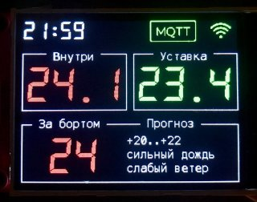

# Термостат комнатный
Сбор и передача на сервер по MQTT комнатной температуры. 
От сервера по MQTT получение уставки, температуры на улице, прогноз на день с rp5.ru.  
Предусмотрено включение экрана по движению, смена цветов иконок и цифр в зависимости от условий.  

## Оборудование:
| Тип |Ссылка|
|-----|------|
| MB  |[ESP32-WROOM-32D](https://www.espressif.com/sites/default/files/documentation/esp32-wroom-32d_esp32-wroom-32u_datasheet_en.pdf)|
| TFT |[ST7789 SPI 240x320](https://aliexpress.ru/item/4001282467099/reviews?filters=&sku_id=12000017591977476)|
| DHT |[DS18B20](https://aliexpress.ru/item/32467815969.html?sku_id=66654224723&spm=a2g2w.productlist.search_results.4.50a42258Nx2BVh)|
| PIR |[AM312](https://aliexpress.ru/item/1005004708511640.html?sku_id=12000030181361708&spm=a2g2w.productlist.search_results.3.32c2404euxD22w)|

## Коммутация:
| ESP32  |	ST7789|
|--------|------|
| GPIO19 |	SDO(MISO)|
| GPIO27 |	LED|
| GPIO18 |	SCK|
| GPIO23 |	SDI(MOSI)|
| GPIO2  |	DC|
| GPIO4  |	RESET|
| GPIO5  |	SC|

	
| ESP32 |DS18B20|
|--------|------|
| GPIO14  |	D|

| ESP32  |PIR AM312|
|--------|------|
| GPIO12 |	D|

## Библиотеки:
Драйвер	https://github.com/russhughes/st7789py_mpy/blob/master/lib/st7789py.py  
Шрифты и иконки конвертировал в bitmap от того же автора.  